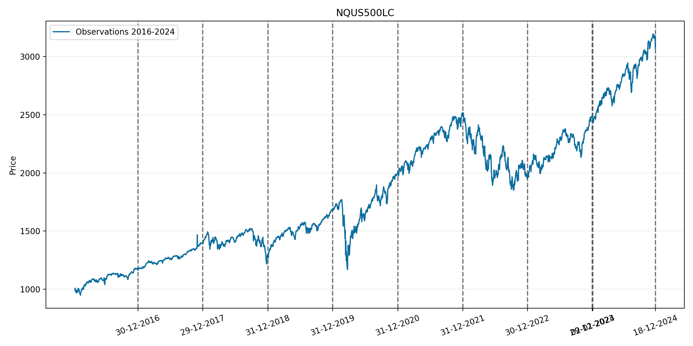
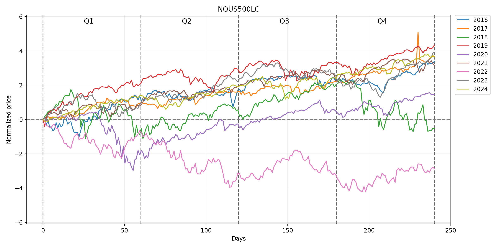
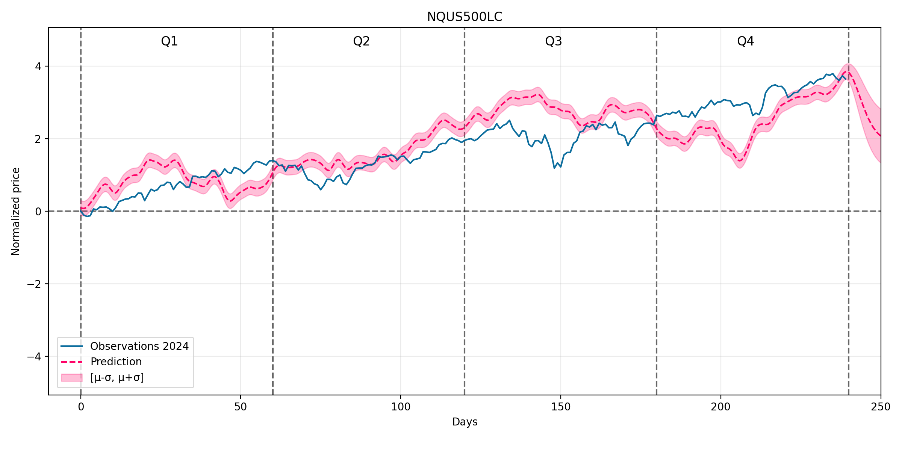

# GprSF : A Gaussian Process Regression Model for Stock-Forecast

The repository is an implementation of the **_Stochastic Processes_** course project using [GPyTorch](https://github.com/cornellius-gp/gpytorch).

## 🏗️ Installation

```shell
git clone https://github.com/Yanyilucas/GprSF.git
cd GprSF
```

We recommend using [Anaconda](https://www.anaconda.com) to set up the environment.

```shell
conda env create -f env.yaml
conda activate gprsf
```

## 💻 Quick Start

### ⏬ Data download

You can download custom data from [Nasdaq](https://www.nasdaq.com).And place the csv file in the `data` directory.

### Data processing

Assuming that $x$ is the observed value of the stock price on a particular day, $\mu$ is the mean of the stock price over all samples, and $\sigma$ is the standard deviation of the stock price over all samples, then $x^*$ is the standardized stock price on that day.

$$
x^*=\frac{x-\mu}{\sigma} \notag
$$

### 🔍 Training & Evaluation

Run the following command and check the output in the `pic` directory.

```sh
sh run.sh
```







## Acknowledge

Our code is based on the implementation of [GaussianProcesses](https://github.com/gdroguski/GaussianProcesses) and [Long-term Stock Market Forecasting using Gaussian Processes](https://www.cs.ubc.ca/~nando/540-2013/projects/p5.pdf). Thanks for their excellent work.
